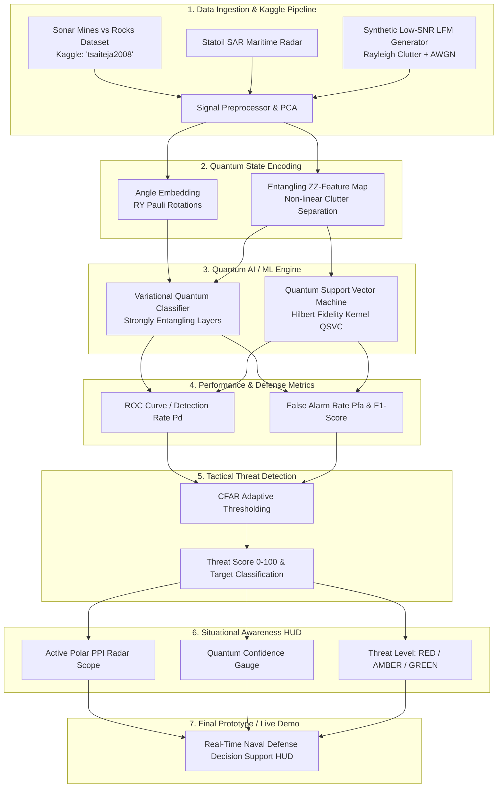

# 🌊 Quantum Radar & Sonar Signal-Processing & Defense Situational Awareness

> **Quantum AI / ML & Quantum Computing for extracting weak radar/sonar returns from noisy environments and providing real-time Maritime Situational Awareness.**  
> **Target Domains:** Naval Defense, Coastal Surveillance, Subsurface Threat & Mine Countermeasures, Maritime Security.

---

## 🏗️ 7-Stage End-to-End System Architecture

---

## 🎯 Tactical Pipeline Stages

### 4. Performance & Defense Metrics
- **ROC Curves**: Detection Probability ($P_d$) vs. False Alarm Rate ($P_{fa}$).
- **Quantum Fidelity Kernels**: Gram matrix heatmap of state overlaps in Hilbert space ($K_{ij} = |\langle \psi_i | \psi_j \rangle|^2$).

### 5. Threat Detection
- **Target Classification**: Distinguishes submerged metallic naval mines from seafloor rocks.
- **Threat Score (0 - 100)**: Multi-factor composite combining quantum probability and measurement confidence.
- **Detection Threshold**: Constant False Alarm Rate (CFAR) adaptive baseline.
- **False-Alarm Control**: Tight probability control for high-clutter sea environments.

### 6. Situational Awareness
- **Target Status**: `HOSTILE`, `SUSPICIOUS`, `CLEAR`.
- **Confidence Score**: Quantum state measurement certainty percentage ($50\% - 99.9\%$).
- **Threat Level**: 🔴 **CRITICAL (RED)**, 🟡 **ELEVATED (AMBER)**, 🟢 **LOW (GREEN)**.
- **Alert & Command Dashboard**: Polar PPI Scope and automated tactical countermeasures feed.

### 7. Final Prototype Demo
- Real-time interactive ping simulation executing through the Parameterized Quantum Circuit (PQC) and rendering the Tactical Situational Awareness HUD.

---

## 🚀 1-Click Interactive Google Colab Notebooks

| Notebook | Focus | 1-Click Launch |
| :--- | :--- | :--- |
| **`Quantum_Radar_Sonar_Colab.ipynb`** | **Full 7-Stage Pipeline**: Kaggle Data, VQC, QSVC, Threat Detection & Situational Awareness HUD |  |
| **`Run_In_The_Quantum_Computer.ipynb`** | **Real Physical QPU Deployment**: IBM Quantum Cloud, 1024 Shots & Error Mitigation |  |

---

## 📜 License
MIT License. Developed for Quantum Information Science & Defense Signal Processing.
