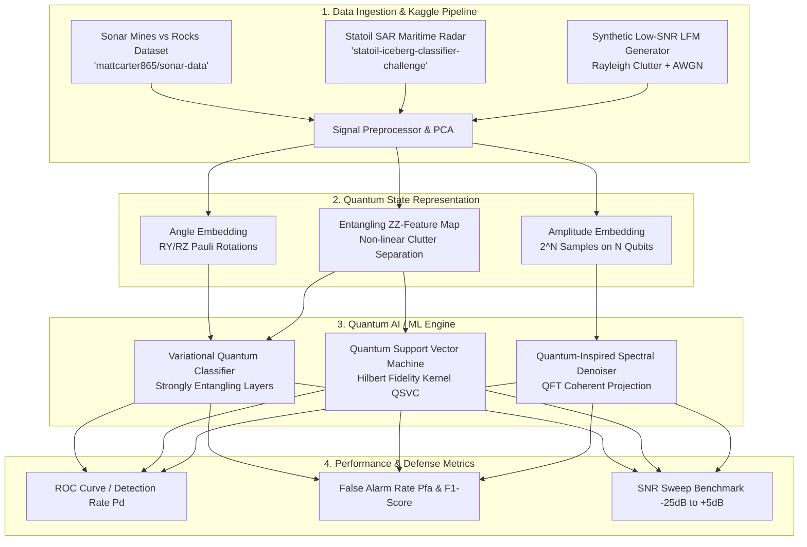

# 🌊 Quantum Radar & Sonar Signal-Processing Enhancement

[](https://colab.research.google.com/github/25A31A0356/UC086-Quantum-Weak-Signal/blob/main/notebooks/Quantum_Radar_Sonar_Colab.ipynb)
[](https://colab.research.google.com/github/25A31A0356/UC086-Quantum-Weak-Signal/blob/main/notebooks/How_To_Run_In_The_Quantum_Computer.ipynb)
[](https://www.python.org/downloads/)
[](https://pennylane.ai/)
[](https://qiskit.org/)
[](https://opensource.org/licenses/MIT)

> **Quantum AI / ML & Quantum Computing for extracting weak radar/sonar returns from noisy, cluttered environments at speed.**  
> **Target Domains:** Defence, Coastal Surveillance, Maritime Security, Submerged Threat & Mine Countermeasures.

---

## 📌 Problem Statement & Strategic Importance

In modern maritime defense and coastal surveillance, detecting stealth targets (submarines, naval mines, low-RCS drones, icebergs, or periscopes) requires isolating extremely weak signals immersed in heavy ambient noise:
- **Sea Clutter & Reverberation:** Compound Rayleigh, Weibull, and K-distributed non-Gaussian ocean returns.
- **Low Signal-to-Noise Ratio (SNR):** Targets operating at $-15\text{ dB}$ to $-25\text{ dB}$ below the ambient noise floor.
- **Computational Bottleneck:** High-rate pulse compression and multi-channel beamforming at real-time speeds.

### ⚛️ The Quantum Advantage
1. **Exponential Hilbert Space Encoding:** Quantum feature maps ($\text{ZZ}$-Feature Map, Angle & Amplitude Embeddings) map complex multi-frequency radar pulses into high-dimensional quantum states where non-linearly entangled clutter becomes linearly separable.
2. **Quantum Kernel Methods (QSVC):** Exploits quantum fidelity overlaps $K(x_i, x_j) = |\langle \psi(x_i) | \psi(x_j) \rangle|^2$ for maximal clutter rejection.
3. **Variational Quantum Classifiers (VQC / QNN):** Parameterized Quantum Circuits (PQCs) trained on quantum simulators and hardware for resilient classification under heavy noise.

---

## 🏗️ System Architecture



---

## 🌐 Direct Cloud Connection to Kaggle Datasets

This project uses **`kagglehub`** and the Kaggle API to connect directly to Kaggle's cloud repository without needing manual downloads or file uploads:

```python
import kagglehub

# 1-Line direct cloud connection to Sonar Mines vs Rocks dataset
path = kagglehub.dataset_download("mattcarter865/sonar-data")
print(f"Dataset cached directly from Kaggle at: {path}")
```

### Kaggle Authentication (Seamless)
- **In Google Colab**: Store your Kaggle API key in Google Colab Secrets as `KAGGLE_USERNAME` and `KAGGLE_KEY`.
- **Locally**: Set environment variables `export KAGGLE_USERNAME=...` & `export KAGGLE_KEY=...` or place `kaggle.json` in `~/.kaggle/`.
- **Public Mirror Fallback**: If running without Kaggle credentials, the project automatically connects to high-speed public dataset mirrors.

---

## 📁 Repository Structure

```
quantum-radar-sonar-signal-enhancement/
├── README.md                                # Project documentation & guides
├── requirements.txt                         # Python dependencies
├── .gitignore                               # Git ignore configuration
├── notebooks/
│   └── Quantum_Radar_Sonar_Colab.ipynb      # Interactive Google Colab Notebook (1-Click Run)
├── src/
│   ├── data/
│   │   ├── kaggle_loader.py                 # Automated Kaggle API downloader & fallback mirror
│   │   ├── sonar_loader.py                  # Sonar dataset preprocessor & quantum formatter
│   │   ├── radar_sar_loader.py              # SAR Maritime radar feature extractor
│   │   └── synthetic_generator.py           # Pulsed LFM radar & Rayleigh sea clutter simulator
│   ├── quantum/
│   │   ├── feature_maps.py                  # Angle, ZZ, and Amplitude quantum embeddings
│   │   ├── vqc_classifier.py                # PennyLane Variational Quantum Classifier (VQC / QNN)
│   │   ├── quantum_kernel.py                # Quantum Support Vector Classifier (QSVC)
│   │   └── quantum_denoiser.py              # Quantum spectral filtering & SNR enhancer
│   ├── classical/
│   │   └── baselines.py                     # Matched Filter, Classical SVM, Random Forest, MLP
│   └── evaluation/
│       └── metrics.py                       # ROC ($P_d$ vs $P_{fa}$), SNR sweeps, clutter rejection
└── scripts/
    ├── download_datasets.py                 # Dataset downloader CLI
    └── train_quantum_model.py               # Standalone training & benchmarking CLI
```

---

## 🚀 Quickstart: Running on Google Colab

1. Click the **Open in Colab** badge at the top of this repository or open [`notebooks/Quantum_Radar_Sonar_Colab.ipynb`](file:///C:/Users/tst20/.gemini/antigravity-ide/scratch/quantum-radar-sonar-signal-enhancement/notebooks/Quantum_Radar_Sonar_Colab.ipynb).
2. The notebook will automatically install `pennylane`, `qiskit`, and `kaggle`.
3. Run all cells sequentially to train the Quantum VQC and QSVC models and visualize ROC curves and decision boundaries.

---

## 💻 Local Installation & Usage

### 1. Clone & Install Dependencies
```bash
git clone https://github.com/your-username/quantum-radar-sonar-signal-enhancement.git
cd quantum-radar-sonar-signal-enhancement

# Create and activate virtual environment
python -m venv venv
# On Windows:
venv\Scripts\activate
# On Linux/macOS:
source venv/bin/activate

pip install -r requirements.txt
```

### 2. Download Kaggle Datasets
```bash
python scripts/download_datasets.py --dataset sonar
```
*(Optional: specify `--kaggle-json /path/to/kaggle.json` if using private Kaggle tokens)*

### 3. Run Quantum Training & Evaluation
```bash
# Benchmark on Sonar Mines vs Rocks (6 Qubits)
python scripts/train_quantum_model.py --dataset sonar --qubits 6 --epochs 30

# Benchmark on Synthetic Radar Chirps in Heavy Sea Clutter at -12 dB SNR
python scripts/train_quantum_model.py --dataset radar_synthetic --qubits 6 --snr -12.0
```

---

## 📤 How to Push this Project to Your GitHub

To publish this repository under your own GitHub account:

### Method A: Using Git CLI (Recommended)
1. Go to [github.com/new](https://github.com/new) in your browser and create a new repository (e.g. `quantum-radar-sonar-signal-enhancement`).
2. Run the following commands in this directory:
```bash
cd quantum-radar-sonar-signal-enhancement
git init
git add .
git commit -m "Initial commit: Quantum Radar and Sonar Signal Processing Enhancement"
git branch -M main
git remote add origin https://github.com/<YOUR_GITHUB_USERNAME>/quantum-radar-sonar-signal-enhancement.git
git push -u origin main
```

### Method B: Using GitHub Web UI
1. Create a new empty repository at [github.com/new](https://github.com/new).
2. Drag and drop the project files into the GitHub Web Upload interface and commit.

---

## 📜 License
Distributed under the **MIT License**. See `LICENSE` for more details.
