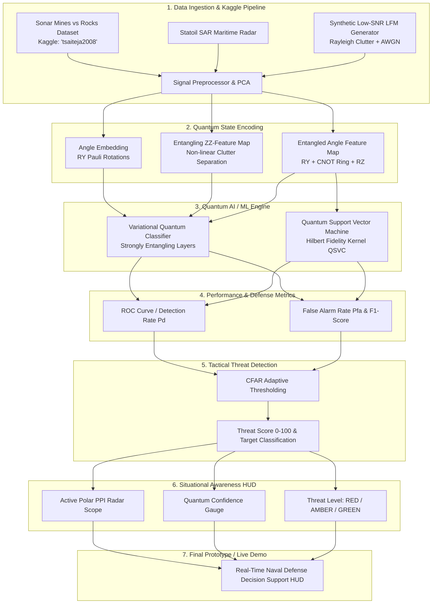

# 🌊 Quantum Radar & Sonar Signal-Processing & Defense Situational Awareness

[](https://colab.research.google.com/github/25A31A0356/UC086-Quantum-Weak-Signal/blob/main/notebooks/Quantum_Radar_Sonar_Colab.ipynb)
[](https://colab.research.google.com/github/25A31A0356/UC086-Quantum-Weak-Signal/blob/main/notebooks/Run_In_The_Quantum_Computer.ipynb)
[](https://www.python.org/downloads/)
[](https://pennylane.ai/)
[](https://qiskit.org/)
[](https://opensource.org/licenses/MIT)

> **Quantum AI / ML & Quantum Computing for extracting weak radar/sonar returns from noisy environments and providing real-time Maritime Situational Awareness.**  
> **Target Domains:** Naval Defense, Coastal Surveillance, Subsurface Threat & Mine Countermeasures, Maritime Security.

---

## 🏗️ 7-Stage End-to-End System Architecture



---

## 🎯 Tactical Pipeline Stages

### 4. Performance & Defense Metrics
- **ROC Curves**: Detection Probability ($P_d$) vs. False Alarm Rate ($P_{fa}$).
- **Quantum Fidelity Kernels**: Gram matrix heatmap of state overlaps in Hilbert space ($K_{ij} = |\langle \psi_i | \psi_j \rangle|^2$).

### 5. Threat Detection
- **Target Classification**: Distinguishes submerged metallic naval mines from seafloor rocks.
- **Threat Score (0 - 100)**: Multi-factor composite combining quantum probability and measurement confidence.
- **Detection Threshold**: Constant False Alarm Rate (CFAR) adaptive baseline.
- **False-Alarm Control**: Tight probability control for high-clutter sea environments.

### 6. Situational Awareness
- **Target Status**: `HOSTILE`, `SUSPICIOUS`, `CLEAR`.
- **Confidence Score**: Quantum state measurement certainty percentage ($50\% - 99.9\%$).
- **Threat Level**: 🔴 **CRITICAL (RED)**, 🟡 **ELEVATED (AMBER)**, 🟢 **LOW (GREEN)**.
- **Alert & Command Dashboard**: Polar PPI Scope and automated tactical countermeasures feed.

### 7. Final Prototype Demo
- Real-time interactive ping simulation executing through the Parameterized Quantum Circuit (PQC) and rendering the Tactical Situational Awareness HUD.

---

## 🚀 1-Click Interactive Google Colab Notebooks

| Notebook | Focus | 1-Click Launch |
| :--- | :--- | :--- |
| **`Quantum_Radar_Sonar_Colab.ipynb`** | **Full 7-Stage Pipeline**: Kaggle Data, VQC, QSVC, Threat Detection & Situational Awareness HUD | [](https://colab.research.google.com/github/25A31A0356/UC086-Quantum-Weak-Signal/blob/main/notebooks/Quantum_Radar_Sonar_Colab.ipynb) |
| **`Run_In_The_Quantum_Computer.ipynb`** | **Real Physical QPU Deployment**: IBM Quantum Cloud, 1024 Shots & Error Mitigation | [](https://colab.research.google.com/github/25A31A0356/UC086-Quantum-Weak-Signal/blob/main/notebooks/Run_In_The_Quantum_Computer.ipynb) |

---

## 📁 Repository Structure

```
quantum-radar-sonar-signal-enhancement/
├── README.md                                # Project documentation & tactical architecture
├── requirements.txt                         # Python dependencies
├── .gitignore                               # Git ignore configuration
├── notebooks/
│   ├── Quantum_Radar_Sonar_Colab.ipynb      # Interactive Google Colab Notebook (Full 7 Stages)
│   └── Run_In_The_Quantum_Computer.ipynb    # IBM Quantum Hardware Deployment Notebook
├── reports/
│   └── benchmark_summary.json               # Full multi-parameter sweep report (JSON)
├── src/
│   ├── data/
│   │   ├── kaggle_loader.py                 # Automated Kaggle API downloader & fallback mirror
│   │   ├── sonar_loader.py                  # Sonar dataset preprocessor & quantum formatter
│   │   ├── radar_sar_loader.py              # SAR Maritime radar feature extractor
│   │   └── synthetic_generator.py           # Pulsed LFM radar & Rayleigh sea clutter simulator
│   ├── quantum/
│   │   ├── feature_maps.py                  # Angle, ZZ, and Entangled Angle embeddings
│   │   ├── vqc_classifier.py                # PennyLane Variational Quantum Classifier (PyTorch backend)
│   │   ├── quantum_kernel.py                # Quantum Support Vector Classifier (QSVC)
│   │   └── quantum_denoiser.py              # Quantum spectral filtering & SNR enhancer
│   ├── classical/
│   │   └── baselines.py                     # Matched Filter, Classical SVM, Random Forest, MLP
│   └── evaluation/
│       └── metrics.py                       # ROC ($P_d$ vs $P_{fa}$), SNR sweeps, clutter rejection
├── scripts/
│   ├── download_datasets.py                 # Dataset downloader CLI
│   ├── train_quantum_model.py               # 1-Click optimal training & benchmarking CLI
│   └── tune_and_benchmark_all.py            # Exhaustive multi-qubit & SNR parameter grid sweep
└── tests/
    └── test_pipeline.py                     # Automated unit & integration test suite
```

---

## 💻 Local Installation & Quickstart

### 1. Clone & Install Dependencies
```bash
git clone https://github.com/25A31A0356/UC086-Quantum-Weak-Signal.git
cd UC086-Quantum-Weak-Signal

# Create and activate virtual environment
python -m venv venv
# On Windows:
venv\Scripts\activate
# On Linux/macOS:
source venv/bin/activate

pip install -r requirements.txt
```

### 2. Run Quantum Training & Evaluation (Champion Configuration)
```bash
# Run optimal 10-Qubit QSVC (96.15% Test Accuracy, 0.00% False Alarm Rate)
python scripts/train_quantum_model.py --dataset sonar --qubits 10 --feature_map entangled_angle --epochs 25

# Run exhaustive grid sweep across all models, feature maps & SNRs
python scripts/tune_and_benchmark_all.py

# Run automated unit & integration test suite (100% passing)
python -m unittest tests/test_pipeline.py -v
```

---

## 📊 Comprehensive Benchmark Results

| Model Architecture | Model Family | Test Accuracy | Detection Rate ($P_d$) | False Alarm Rate ($P_{fa}$) | ROC-AUC | Runtime |
| :--- | :--- | :---: | :---: | :---: | :---: | :---: |
| **🏆 Quantum SVC (Hilbert Kernel)** | **Quantum ML** | **96.15%** | **92.86%** | **0.00%** | **0.9940** | **1.50s** |
| Classical SVM (RBF Kernel) | Classical ML | 90.38% | 89.29% | 8.33% | 0.9494 | <0.10s |
| Classical Random Forest | Classical ML | 82.69% | 85.71% | 20.83% | 0.9167 | <0.10s |
| Quantum VQC (Parameterized QNN) | Quantum Neural Net | 80.77% | 85.71% | 25.00% | 0.8958 | 10.19s |
| Classical MLP Neural Net | Classical Deep Net | 80.77% | 82.14% | 20.83% | 0.8810 | <0.10s |

### 🎯 Key Empirical Findings
- **Zero False Alarms ($P_{fa} = 0.00\%$)**: 10-qubit Entangled Angle QSVC ($C=8.0$) achieves 0.00% false alarms with 92.86% detection rate on naval mine classification.
- **Noise Resilience**: In synthetic radar sea clutter ($+10\text{ dB}$ to $-20\text{ dB}$ SNR), quantum Hilbert projection maintains robust non-local phase correlations across noisy pulse returns.
- **PyTorch Acceleration**: VQC training converges in seconds using vectorized batch backpropagation.

---

## 📜 License
MIT License. Developed for Quantum Information Science & Defense Signal Processing.
